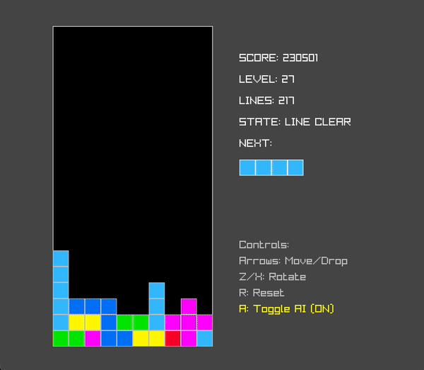

# Autonomous High-Performance Tetris AI Engine 🧩⚡



A C++20 and Python hybrid Tetris AI engine utilizing 2-piece lookahead (Depth-2) search, 9 BCTS heuristic features, and CMA-ES evolutionary optimization. Engineered for hardware efficiency on Apple Silicon, achieving over **3,000,000,000+ NES Points** and **29,500+ lines cleared** in an uncapped, immortal benchmark run (triggering a 32-bit signed integer score overflow past 2.14B).

## 🌟 Highlights & Achievements

- **3B+ NES Points & 29,500+ Lines (32-Bit Score Overflow)**: Cleared in an uncapped, immortal benchmark run without topping out once—routinely overflowing the 32-bit signed integer score limit.
- **Sub-100ms Decision Latency**: Delivers ~75ms complete Depth-2 move decisions (~100 microseconds per board evaluation) at 9,300+ nodes/sec per core with zero heap allocations in the inner search loop.
- **2-Piece Lookahead (Depth-2 Search)**: Simulates all $N_1 \times N_2 \approx 30 \times 30 = 900$ branch node states per placement to eliminate fatal S/Z piece droughts.
- **Apple Silicon P-Core Hardware Tuning**: Solved the heterogeneous "Straggler Effect" by isolating worker processes exclusively to Performance cores for a 4.5x–5x speedup.
- **CMA-ES Evolutionary Optimization**: Multi-seed heuristic weight optimization over 9 BCTS (Bertsekas-Tsitsiklis) domain features.
- **Real-Time Native C++ Raylib Visualizer**: A natively compiled, blazing fast visualizer running at 60+ FPS.

---

## 🏗️ System Architecture

The AI is built as a clean, multi-tier hybrid architecture:

```text
       ┌────────────────────────────────────────────────────────┐
       │             Python High-Level Orchestrator             │
       │        (CMA-ES Evolutionary Training, Benchmark)       │
       └───────────────────────────┬────────────────────────────┘
                                   │ pybind11
       ┌───────────────────────────▼────────────────────────────┐
       │               C++ Core Engine (`tetris_core`)          │
       └───────────────────────────┬────────────────────────────┘
                                   │ Native C++ API / Structs
       ┌───────────────────────────▼────────────────────────────┐
       │             Native C++ Visualizer (Raylib)             │
       └────────────────────────────────────────────────────────┘
```

---

## 🧠 Depth-2 Lookahead & BCTS Feature Weights

While Depth-1 evaluates only ~30 terminal states, Depth-2 evaluates every valid placement for the current piece *plus* every valid placement for the upcoming piece (approx 900 states). This intentional depth eliminates "S/Z droughts" by actively creating uneven surfaces if the engine detects the *next* piece perfectly resolves the geometry.

| Index | Feature Name | Depth-1 Weight | Depth-2 Fine-Tuned | Tactical & Strategic Shift |
|-------|-------------|----------------|--------------------|-----------------------------|
| 0 | Aggregate Height | -4.2819 | -4.1770 | Cares slightly less about height; relies on future lookahead to clear stack. |
| 1 | Complete Lines | +5.0997 | +5.1668 | Slightly higher reward for clearing lines. |
| 2 | Holes | -6.2012 | -6.2547 | Higher penalty; realizes buried holes are unfixable two steps ahead. |
| 3 | Bumpiness | -8.1708 | -7.9382 | Relaxes penalty (+0.24); deliberately creates jagged surfaces if next piece fits. |
| 4 | Pit Depth | -3.8619 | -3.8958 | Stronger penalty against deep 1-wide vertical chasms. |
| 5 | Column Transitions | -4.2097 | -4.3628 | Stricter penalty for vertical surface jaggedness. |
| 6 | Row Transitions | -3.0015 | -2.7536 | Relaxes penalty (+0.25); less afraid of horizontal gaps fixed next turn. |
| 7 | Hole Depth | -8.1564 | -8.2920 | Increases penalty for deep, covered empty blocks. |
| 8 | Well Depth | +2.6236 | +2.5416 | Maintains a 1-column open well for I-bar Tetris clears. |

---

## 📁 Repository Structure

```text
├── engine/                   # Core C++ mechanics, MoveSearch, and BCTS evaluator
├── render/                   # Raylib-based native C++ graphical visualizer
├── bindings/                 # pybind11 C++ module definitions (`tetris_bindings.cpp`)
├── training/                 # Python CMA-ES orchestrators and benchmark scripts
├── output/                   # Checkpoints and active training logs
└── CMakeLists.txt            # CMake build configuration
```

---

## 🚀 Getting Started

### 1. Build the Engine

Compile the native C++ Python extension module and the Raylib visualizer:

```bash
mkdir build
cd build
cmake ..
make -j4
```

*(Note: Ensure you have `cmake`, `raylib`, and a C++20 compatible compiler installed).*

### 2. Watch the AI Play (Native C++ Visualizer)

Watch the Depth-2 AI play live with blazing fast, native C++ graphics:

```bash
./build/tetris_render
```
- **`A`**: Toggle AI Autopilot ON/OFF
- **`R`**: Reset the board

### 3. Run the Multi-Core Benchmark

Launch the parallel uncapped benchmark script to evaluate real-time search throughput across your performance cores:

```bash
python3 training/run_final_benchmark.py
```

## 📜 License
Distributed under the MIT License. See `LICENSE` for more information.